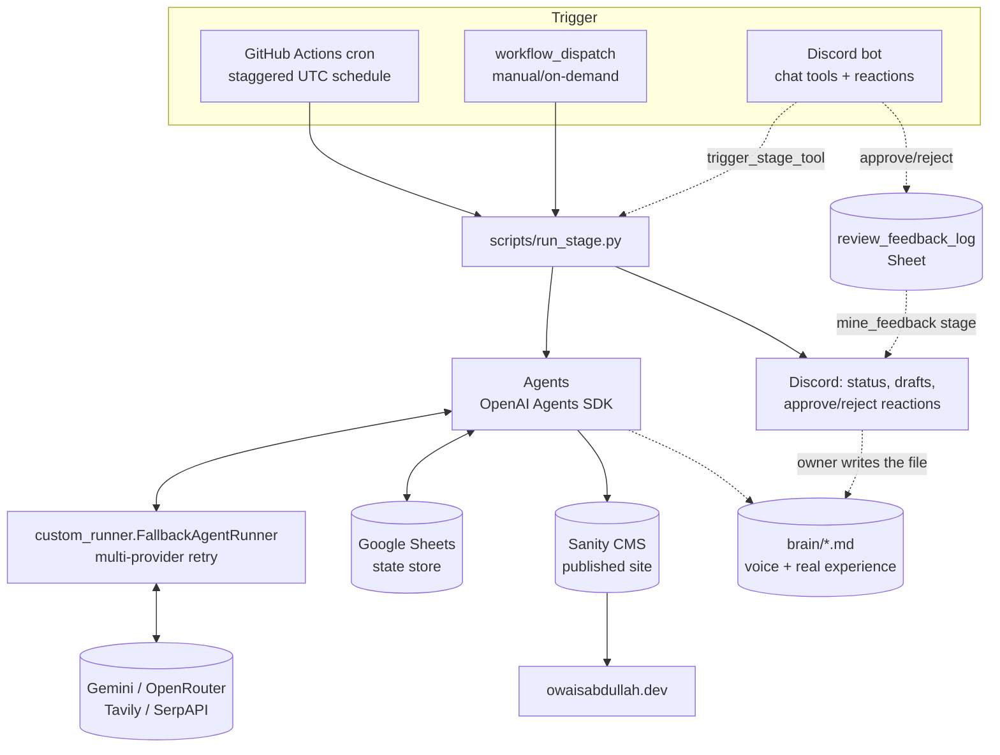

# Pipeline Flow & Current State — 2026-08-17

This is the current, verified architecture and flow of the SEO blog pipeline — what actually
runs today, not the aspirational design. `docs/overview.md` is now a short pointer to this doc
(it used to describe a stale "ContentSpark AI" design; rewritten the same day this doc was
written). Treat this doc as authoritative for "how it works now"; `docs/architecture_roadmap.md`
is authoritative for "what third-party tools/features could be added next" (this doc's Gaps
section pulls from it rather than repeating it).

## Architecture at a glance

- **Trigger layer**: GitHub Actions (`.github/workflows/pipeline.yml`) is the real scheduler —
  its own comment says it explicitly "replaces cron-job.org + FastAPI HTTP triggering." The
  Discord bot (`discord_bot/bot.py`, deployed separately via `deploy-bot.yml` to a VPS through
  Dokploy) is the always-on human interface: status queries, approve/reject reactions, and
  `trigger_stage_tool` for on-demand runs via `gh workflow run`.
- **Execution layer**: `scripts/run_stage.py` — one process per stage, no server involved, no
  HTTP timeout risk on a long-running stage. `concurrency: group: contentspark-pipeline` with
  `cancel-in-progress: false` means overlapping triggers queue instead of racing.
- **Agent layer**: OpenAI Agents SDK, every model call routed through
  `blog_agent/custom_runner.FallbackAgentRunner`, which retries across Gemini → OpenRouter (and
  falls further where configured) on quota/transient errors, with per-model usage tracking.
  Tracing to OpenAI is explicitly disabled (`set_tracing_disabled(True)` in `main.py`) since no
  OpenAI key is used.
- **State**: Google Sheets is the pipeline's database — `ContentSpark_Keywords` (queue),
  `research_data`, `content_briefs`, `generated_posts`, `approved_unpublished`,
  `published_posts`, `repurposed_content`. Sanity CMS is the actual published destination, and
  is treated as more authoritative than the sheet for "what's really live" in several stages
  (see `freshness_sweep` and `search_performance_review` below).
- **`main.py` (FastAPI) is confirmed legacy for scheduling — not called by anything in the live
  pipeline.** Verified directly: `pipeline.yml` runs `scripts/run_stage.py` as a plain Python
  process (imports agent code in-process, no HTTP); `discord_bot/bot.py` is a completely
  separate deployment with its own Dockerfile (`discord_bot/Dockerfile`, `COPY bot.py` only —
  it has no access to the rest of the repo, including `main.py`, at build time); `deploy-bot.yml`
  only builds/deploys that bot image. Nothing builds or deploys the *root* Dockerfile (the one
  `main.py` runs in) — there's no `deploy-main.yml` or equivalent. `docs/service_setup.md`
  already documents this explicitly: "`main.py`/the HF Spaces Dockerfile are left in the repo,
  untouched, but unused."
  **Where it would run if it were still live**: the root Dockerfile is built specifically for
  Hugging Face Spaces (non-root UID 1000, port 7860 — HF Spaces' convention), matching the
  original design in the old `docs/overview.md` ("hosted on Hugging Face Spaces, scheduled via
  Cron-Job.org"). It is **not** what runs on the Hetzner VPS — that VPS (via Dokploy) currently
  hosts only the Discord bot's small, separate container. So if main.py is still deployed
  anywhere, it's costing Hugging Face Spaces resources, not VPS resources — the VPS Dokploy
  instance was never main.py's home.
  **What this repo can't tell you**: whether an actual live Hugging Face Space (or some other
  manually-created deployment of the root Dockerfile) still exists and is running right now —
  that's account/infra state outside git, invisible from the repository. If a free-tier HF Space
  was left running, it likely auto-sleeps after inactivity and costs little; if it's on a
  persistent/paid tier, or was separately deployed as its own app in Dokploy, it could be
  running and billing for genuinely nothing, since nothing calls its endpoints anymore. Worth a
  direct check of the Hugging Face Spaces dashboard (and, separately, the Dokploy panel for any
  application besides the bot) to confirm nothing orphaned is still running.

## The pipeline stages

All 11 stages live in `scripts/run_stage.py`; eleven `workflow_dispatch` options in
`pipeline.yml` map 1:1 to them. Six run on a fixed schedule; five are on-demand only (though
`mine_feedback`'s schedule is now event-driven rather than time-based — see below).

| Stage | Trigger | Reads | Writes | Human checkpoint |
|---|---|---|---|---|
| `discover_topics` | Every ~2 days | Reddit/Quora trending (Tavily) | Discord message with candidates | **Real gate** — each candidate needs an explicit ✅/❌ reaction; nothing is auto-queued |
| `research` | Daily | `ContentSpark_Keywords` (next row) | `research_data` | None — flows straight through |
| `brief` | Daily | `research_data` (`Generated`=No) | `content_briefs` | None — flows straight through |
| `content` | Daily | `content_briefs` (`Generated`=No) | `generated_posts`, `claims_audit` | **Nominal gate, defaults open** — see Gaps (kept as-is on request) |
| `post` | Daily | `approved_unpublished` | Sanity + `published_posts` | Implicit — only runs on rows already marked Approved |
| `edit_post` | On-demand | `EDIT_TITLE`/`EDIT_INSTRUCTION` inputs, or a sheet row, or Sanity directly if untracked | Sanity (live patch) + sheet if a row exists | The instruction itself, given by a human via `/edit` or chat |
| `repurpose` | On-demand only (no cron — see below) | `published_posts`/Sanity | `repurposed_content` (draft only) | **Real gate** — recommend-only by default; drafting requires a human to name a specific post |
| `freshness_sweep` | Weekly (Sun) | Sanity `_createdAt`, rotates via "Last Freshness Check" | Discord flag + edit suggestion | Human decides whether to act on the flag |
| `search_performance_review` | Weekly (Wed) | Search Console API + Sanity | Discord flag + edit suggestion | Human decides whether to act on the flag |
| `mine_feedback` | No cron — auto-dispatched by the bot right after every Discord approval, plus reachable on demand | `review_feedback_log` (Sheet) | Discord message with candidate `brain/` entries | **Real gate** — proposes patterns only; the owner writes the actual file, nothing is ever auto-saved to `brain/` |
| `log_coverage` | Daily | `review_feedback_log` (Sheet, APPROVED rows only) | `brain/coverage-*.md` files, committed + pushed to this repo | **No human gate, by design** — see "What changed this session": every file is a plain fact (topic/score/date), never a fabricated opinion, so auto-writing it doesn't reintroduce the fabrication risk the other gates exist to prevent |

**Why `repurpose` has no cron entry**: it used to run daily and re-post the full recommendation
list to Discord unprompted — directly contradicting the intended "I decide what gets
repurposed" design (see `docs/incident_ledger.md` E10). It's still fully reachable via
`trigger_stage_tool` in chat or `gh workflow run -f stage=repurpose`.

### `content` stage in detail (where most of this session's work lives)

1. Pulls the first ungenerated brief from `content_briefs`.
2. Loads style guide via `get_author_context_tool` (tone, banned words, live bio from
   `owaisabdullah.dev/api/profile`).
3. **New**: loads real first-hand experience via `get_brain_notes_tool(topic)` — see below.
4. Drafts the post, fact-checks claims via Tavily, iterates against
   `content_evaluation_agent`'s scoring (readability/relevance/SEO/value) up to 3 rounds or
   until score ≥ 90.
5. **New**: the evaluator's `Notes` field now carries a structured claims ledger (claim →
   source URL or `UNVERIFIED`), not a vague "fact-checking limited" aside.
6. Returns Title/Generated Content/FAQs/Quality Score/Summary/**Claims Notes** as JSON only —
   **the agent no longer saves anything itself.** `scripts/run_stage.py::run_content()` does all
   the writes in plain Python after `run_with_fallback` fully returns: `_ensure_content_persisted()`
   to `generated_posts` (`Approve/Disapprove` still defaults to `"Approved"` — kept as-is, see
   Gaps #1), `_persist_claims_audit()` to a `claims_audit` worksheet (skips silently if there's no
   real claims ledger to record), and `_graduate_content_brief()` to clean up the source
   `content_briefs` row. See "What changed this session" for why the write moved out of the
   agent's own turn.

## What changed this session

1. **`brain/` knowledge base** (`tools/tools.py::get_brain_notes_tool`, wired into
   `content_generator_agent` as Step 2.5 in `blog_agent/blog_agents.py`). Distinct from
   `get_author_context_tool`'s static style guide: this is the owner's real stories, opinions,
   and numbers, tag-matched against the topic. Starts empty by design — no fabricated entries.
2. **Claims ledger, now persisted** — `content_evaluation_agent`'s `Notes` output field carries
   a structured claim → source (or `UNVERIFIED`) list, and `content_generator_agent`'s new Step
   6.5 writes it to a `claims_audit` worksheet as a durable, per-post audit row (see stage detail
   above) — not just visible in run logs anymore.
3. **Review-feedback loop, Sheets-backed** (`discord_bot/bot.py::_log_review_feedback`) — every
   ✅/❌ and every `set_post_approval_tool` call appends timestamp/status/title/score/summary to
   a `review_feedback_log` Google Sheet worksheet, through the same rate-limit-safe retry wrapper
   `add_keyword` uses (`_run_with_sheets_retry`) rather than an unguarded write. **Correction
   from an earlier version of this feature this session**: it originally wrote to a local
   `brain/_feedback_log.md` file, which doesn't work — the bot's Docker build context is
   `discord_bot/` only (`COPY bot.py`, nothing else), so it has no filesystem access to `brain/`
   at all, and the container doesn't persist across redeploys regardless. A Sheet is the one
   store both the bot and the GitHub-Actions-executed pipeline can actually reach, same as every
   other piece of shared state in this system.
4. **`mine_feedback` stage** (`scripts/run_stage.py::run_mine_feedback`, new
   `feedback_pattern_agent` in `blog_agent/blog_agents.py`) — on-demand stage that scans
   `review_feedback_log` for a real recurring pattern (needs signal across multiple rows, never
   stretches a single data point) and posts candidate `brain/` entries to Discord. Proposes only
   — never writes to `brain/` itself; the owner authors the actual file if a candidate holds up.
   Wired into `pipeline.yml`'s `workflow_dispatch` options, no cron (same "I decide" philosophy
   as `repurpose`).
5. **`run_looks_failed()` shared and fully migrated** (`lib/run_result_utils.py`) — the
   JSON-status-aware replacement for the old `"error" not in str(result)` substring check (which
   had caused at least 7 separate live incidents — successful runs treated as failures,
   triggering unwanted retries and, in one case, a duplicate Sanity publish). Previously only
   `research_agent.py` used the safe version; `image_agent.py` (2 call sites) and
   `posting_agent.py` (2 call sites) still had the raw pattern. All four are now migrated to the
   shared function; `research_agent.py` imports it instead of keeping its own copy.
6. **`docs/incident_ledger.md`** — a structured, subsystem-indexed record of settled bugs
   (Symptom/Root cause/Evidence/Status), built from real commit history, so the false-positive
   bug class and others don't get silently re-discovered from scratch.
7. **`docs/overview.md` rewritten** — the stale "ContentSpark AI" description is gone; it's now
   a short pointer to this doc plus a table of what every other doc in `docs/` is for.
8. **`main.py`'s status confirmed, not just asserted** — see the architecture section above for
   the full verification chain (what builds it, what doesn't, where it would actually run if
   still live, and what's genuinely unknowable from the repo alone).
9. **`content_generator_agent`'s sheet writes moved out of its own retryable loop** — it
   previously called `manage_sheet_data_tool` three times inside its own turn (save to
   `generated_posts`, save to `claims_audit`, update `content_briefs`), the same replay-on-
   fallback-restart risk as `docs/incident_ledger.md` E2 (duplicate `research_data` row), already
   fixed once for the research stage but never migrated here. Now fixed the same way: the agent
   returns JSON only (`Claims Notes` included, empty string if there's no real ledger to report
   — never fabricated); `run_content()` in `scripts/run_stage.py` does all three writes in plain
   Python after `run_with_fallback` fully returns — `_ensure_content_persisted()` (already
   existed, already title-deduped) for `generated_posts`, the new `_persist_claims_audit()` for
   `claims_audit`, and the already-existing `_graduate_content_brief()` for `content_briefs`
   cleanup. Verified with a fake in-memory sheet: one write on success, no duplicate on a
   simulated replay, no claims row when there's nothing real to record. See `incident_ledger.md`
   E2 for the full before/after.
10. **Real screenshots, scoped v1** (`tools/screenshot_tool.py::capture_screenshot_tool`, new
    Playwright/Chromium dependency, wired into `contextual_image_insertion_agent`) —
    `contextual_image_insertion_agent` can now capture a genuine screenshot of a real tool
    instead of a stock photo, for in-content images specifically (not the hero image, which
    stays abstract per `image_selection_agent`'s existing design). Deliberately scoped down
    rather than open-ended:
    - **Public pages only, no login** — the tool can't authenticate anywhere, so it only ever
      sees what a logged-out visitor sees. This is also why no secret-redaction step was needed
      (compare to a system that captures authenticated pages, which must redact on-screen
      credentials before use).
    - **Anti-hallucination guardrail**: the agent may only screenshot a URL that appears
      verbatim in the post's own already-verified `EXTERNAL_LINKS_MD` — never one it constructs
      or guesses, same rule that already fixed the internal-links hallucination bug (E8).
    - **SSRF guard**: `_url_is_safe_public()` blocks non-http(s) schemes and any hostname
      resolving to a private/loopback/link-local/reserved address, since this hands an
      LLM-directed headless browser the ability to fetch a URL it chooses.
    - Falls back to `get_stock_image_tool` on any capture failure — never treated as fatal.
    - Verified for real: installed Chromium locally and captured an actual PNG screenshot of a
      live public page end-to-end; the SSRF guard was tested against `localhost`, `127.0.0.1`,
      and a `file://` scheme (all correctly blocked) and a real public URL (correctly allowed).
    - `pipeline.yml` now installs Playwright's OS deps + Chromium binary, but **only on the
      `post` stage** (`contextual_image_insertion_agent` runs inside `run_posting_workflow()`,
      which `post` calls -- images are selected when a post is published, not when it's drafted,
      so `content` never needs Chromium at all) — the browser binary download is
      cached across runs (`actions/cache`, keyed on `uv.lock`) so most runs don't re-download the
      ~180MB browser.
    - **Not done**: authenticated capture (would need a per-service login flow and secret
      redaction — meaningfully bigger scope, deliberately left out), and there's no guarantee
      `EXTERNAL_LINKS_MD` will often contain a URL worth screenshotting — this makes the
      capability available, it doesn't guarantee it fires often.
11. **Approve → brain, closing the loop** (per explicit request, refined over two follow-up
    clarifications rather than the first guess):
    - **`mine_feedback`'s trigger moved from manual to automatic.** `discord_bot/bot.py`'s
      `_log_review_feedback` now dispatches the `mine_feedback` workflow immediately after every
      Discord approval (never after a rejection), instead of requiring `/run` or a chat command.
      The stage itself is completely unchanged: still needs `_MINE_FEEDBACK_MIN_ROWS` real rows,
      still only posts a candidate to Discord. **The review gate did not move** — only when the
      evaluation runs did.
    - **New `log_coverage` stage** (`scripts/run_stage.py::run_log_coverage`, daily) — the one
      genuinely automatic write into `brain/` this session added, and the one place a bare
      approval *does* turn into a file with no human step in between. It batches newly-APPROVED
      `review_feedback_log` rows into small `coverage-<slug>.md` files (title, tags, approval
      date, score, summary) and **commits + pushes them itself** — the first stage in this
      pipeline that writes back to its own repo. Deliberately safe to automate because nothing
      in it is invented: every file states plainly it's an auto-logged fact, not personal voice,
      and `content_generator_agent`'s Step 2.5 was updated to use it only for topic-overlap
      awareness ("this angle was already covered") — never to quote it as a first-person story.
      Idempotent (skips a title that already has a coverage file, so re-running never
      duplicates). Required a new job-level `permissions: contents: write` in `pipeline.yml`
      (every other stage only reads its checkout and writes to external services).
    - Verified for real, not just imported: ran `run_log_coverage()` against an isolated scratch
      git repo (a real bare "remote" + a real clone, not the actual project repo) with synthetic
      approved/rejected rows — confirmed only the approved ones got files, the commit landed,
      the push reached the scratch remote, and a second run produced zero new files/commits
      (true idempotency, not just "didn't crash").

## Gaps — ranked by what's actually worth doing next

**Closed this session**: the claims ledger is now persisted (`claims_audit`), the feedback log
has a mining step (`mine_feedback`, now auto-triggered on approval) and is on durable shared
storage (Sheets, not a local file), `main.py`'s status is now verified rather than asserted,
`docs/overview.md` no longer contradicts the real system, `content_generator_agent`'s
write-replay risk (E2's bug class) is fixed, real (public-page) screenshots are now a capability
the content pipeline has, and approved posts now automatically leave a factual trace in `brain/`
via `log_coverage`. Details in "What changed this session" above.

1. **The `content` stage's approval gate defaults to "Approved."** `blog_agents.py:299,313,358`
   — every generated post is written to `generated_posts` as already-approved, and the `post`
   stage will publish it on schedule unless a human proactively reacts ❌ first. Compare to
   `discover_topics`, `repurpose`, and `mine_feedback`, which are all *real* gates. **Explicitly
   left as-is on request** — not a technical blocker, a deliberate choice not made yet.

2. **No real search-demand data anywhere in topic selection** (already flagged in
   `docs/architecture_roadmap.md` §2, still true). `discover_topics` and the manual keyword
   queue both run on "is this currently being discussed" (Tavily/Reddit/Quora), never "is this
   actually searched for, and how competitive is it." DataForSEO is the roadmap's recommended
   fix — needs a paid-tool budget decision from the owner before it's worth starting.

3. **`brain/` has no real voice entries yet, and `review_feedback_log` has no real rows yet**
   (needs ≥5 real review decisions before `mine_feedback` will even attempt a pattern search —
   see `_MINE_FEEDBACK_MIN_ROWS`). `log_coverage`'s auto-written `coverage-*.md` files will
   start appearing on their own the first time a real post gets approved in Discord — that part
   no longer needs anything from the owner. The genuine voice entries (real stories, opinions,
   numbers) still do, and always will, by design.

4. **E14 from the incident ledger is still open**: the historically leaked Google
   service-account key was scrubbed from git history, but whether it was actually rotated in
   GCP IAM has never been confirmed by anyone with GCP IAM access. Not something a coding
   session can close by editing files — needs the owner to check directly.

5. **Whether a live Hugging Face Space (or other stray deployment of the root Dockerfile) is
   still running and billing for nothing** — confirmed from the repo that nothing keeps it
   updated or even necessarily running anymore, and the owner has confirmed the only current
   deployments are the Discord bot (Dokploy/Hetzner VPS) and the pipeline (GitHub Actions) — no
   third deployment for `main.py`. Consistent with "not running," but a live Space created before
   this pipeline existed could still be sitting there forgotten regardless of what currently
   deploys to it; worth one direct look at the HF Spaces dashboard to rule that out for good.

6. **`brief_agent` likely has the same write-inside-the-agent-loop shape** that
   `content_generator_agent` just got fixed for (item 9 above) — `run_brief()` in
   `scripts/run_stage.py` has its own `_tool_call_succeeded(result, "Row appended to
   content_briefs")` salvage path, the same tell that was there for content before the fix.
   Not verified or fixed this session (out of the scope that was asked for) — flagging since the
   pattern is now a known, named thing rather than something to rediscover from scratch next
   time it causes a duplicate row.
